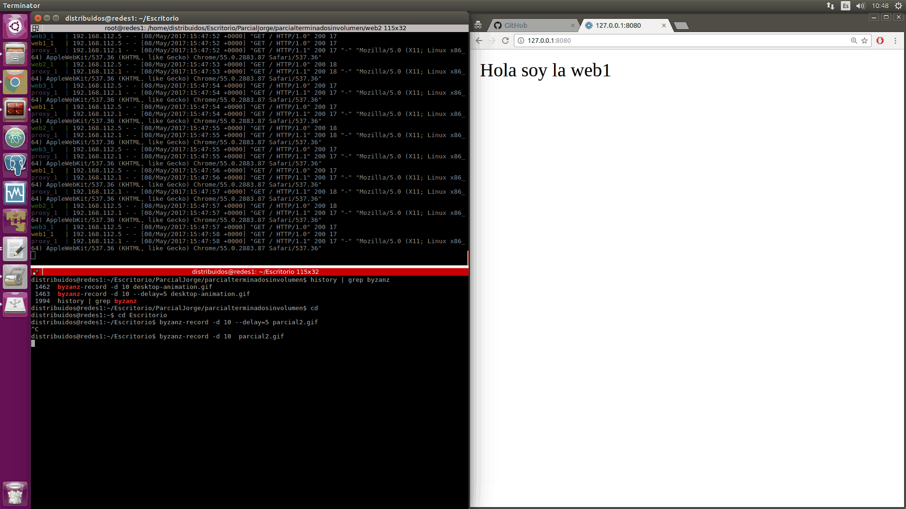

### Examen 2

**Universidad ICESI**  

**Curso:** Sistemas Distribuidos  

**Docente:** Daniel Barragán C.  

**Tema:**  Automatización de infraestructura (Docker) 

**Estudiante:** Esteban Camacho B.

**Código:** A00320168

### Objetivos
* Realizar de forma autónoma el aprovisionamiento automático de infraestructura
* Diagnosticar y ejecutar de forma autónoma las acciones necesarias para lograr infraestructuras estables
* Integrar servicios ejecutandose en nodos distintos

### Herramientas utilizadas
* Docker
* Imagenes de Nginx y Http

### Descripción
En la realización del balanceador de carga se utilizó un servidor encargado de realizar 
el balanceo este fue configurado con un contenedor Nginx y tres servidores web
los cuales contenian con index para cargar la muestra de funcionamiento.

### Procedimiento

**1) Configuracion del archivo Dockerfile del servidor Nginx:**

```python
#Se usa la imagen de nginx
FROM nginx

#Se elimina el archivo de configuración default y su carpeta

RUN rm /etc/nginx/conf.d/default.conf && rm -r /etc/nginx/conf.d

#Se agrega el archivo de configuracion de nginx

ADD nginx.conf /etc/nginx/nginx.conf

#Se agrega esta linea para que el contenedor no termine su ejecucion.

RUN echo "daemon off;" >> /etc/nginx/nginx.conf

CMD service nginx start
```

**2) Configuración del archivo nginx.conf para la distribución:**
```python
worker_processes 4;
 
events { worker_connections 1024; }
 
http {
    sendfile on;
 
    upstream app_servers {
        server web1;
        server web2;
        server web3;
    }
 
    server {
        listen 80;
 
        location / {
            proxy_pass         http://app_servers;
            proxy_redirect     off;
            proxy_set_header   Host $host;
            proxy_set_header   X-Real-IP $remote_addr;
            proxy_set_header   X-Forwarded-For $proxy_add_x_forwarded_for;
            proxy_set_header   X-Forwarded-Host $server_name;
        }
    }
}
```
**3) Configuración de los servidores web, para ello se modifica el Dockerfile de las diferentes servidores web:**

```python
#Se usa la imagen httpd
FROM httpd
#Se agregar el archivo index.html el cual mostrara la informacion de la web pertinente
ADD index.html /usr/local/apache2/htdocs/index.html
```
**4) Configuración del archivo index.html:**
Aquí se pone aquello que quiere que muestre la página en el navegador para este caso
```python
<h1> Hello World I am a web one <h1>
```

**5) Configuracion del docker-compose.yml para la gestión de los contenedores:**
``` python
version: '2'
services:
  web1:
    build: ./web1
    volumes:
    - dataWeb1:/usr/local/apache2/htdocs
  web2:
    build: ./web2
    volumes:
    - dataWeb2:/usr/local/apache2/htdocs
  web3:
    build: ./web3
    volumes:
    - dataWeb3:/usr/local/apache2/htdocs
  proxy:
    build: ./nginx
    ports:
    - "8080:80"
    volumes:
    - volNgin:/etc/nginx/volNgin 
volumes:    
    dataWeb1: 
    dataWeb2:
    dataWeb3:
    volNgin:
    

 
```
**6) Para la prueba de funcionamiento se ejecuto el siguiente comando:**

```python
docker-compose -p "hello" up
```


### Problemas Encontrados

* Para la configuración de nginx, fue complejo la configuración de los volúmenes debido a que este maneja unas carpetas de configuración preestablecidas, que en algunas ocasiones complican el acceso y la modificación para proceder a guardar archivos. Otra de las complicaciones fue unos espacios el cual no dejaba cargar los volúmenes para solucionar el error se configuro el archivo poniendo al mismo nivel de services del archivo docker-compuse.yml la palabra volumes donde van todos los volúmenes que se desean utilizar y con esto se corrigió el error.
* Otro de los problemas es que debido a que cada que se ejecuta el comando “docker-compose up” se creaban repositorios y contenedores los cuales quedaban en la memoria cache (nivel L1 o quizá L2) el cual para la realización de pruebas era dificil gestionar las versiones. Para gestionar esta solución en primera instancia eliminaba imagen por imagen con el comendo, docker kill [ID image] pero debido a que se realizaba uno por uno al igual que, docker rm [ID Image] se ejecuto el siguiente comando para ejecutar la eliminación de todos sin que quedara en cache, docker rm $(docker ps -a -q) -f


